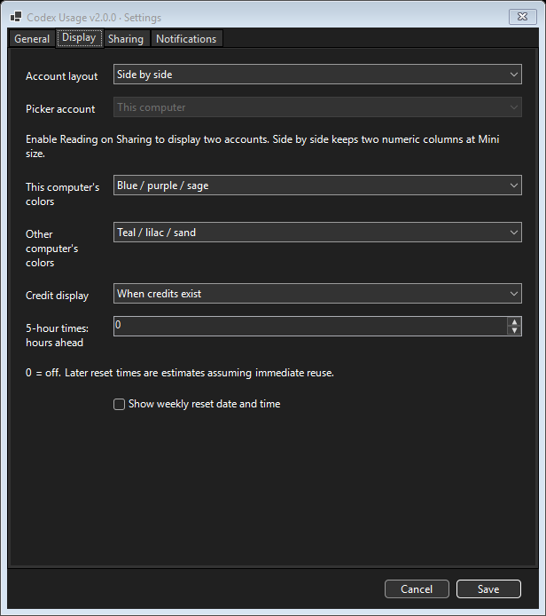
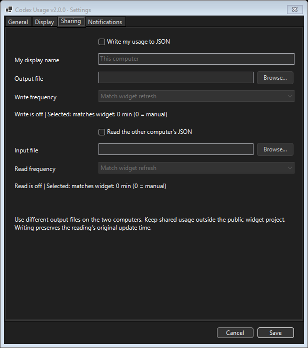

# Codex Usage Widget

A small Windows desktop and tray widget for Codex **5-hour and weekly usage left**, reset times, credits, and notifications. Optionally show a second computer's account through private shared JSON files.

**Version 2.0.1** · [Changelog](changelog.md) · [Detailed guide and troubleshooting](extradetails.md)

## Quick start

1. Install **PowerShell 7** and **Codex**, and sign in to Codex on this computer.
2. Download the repository and extract it. Keep all files together.
3. Double-click **Start-CodexUsageWidget.cmd**.

Optional: run **Create-DesktopShortcut.cmd** for a desktop shortcut. OneDrive destinations include the computer name to avoid shortcut conflicts between machines. Enable **Launch at Windows sign-in** from the tray menu for automatic startup.

## Widget sizes

Percentages show **quota remaining**: 100% is full and 0% is exhausted. Credits appear when available.

| Mini | Small | Medium | Large / Default |
| --- | --- | --- | --- |
|  |  |  |  |

Drag to move or resize. Use **↻** to refresh, **◉ / ○** for always on top, **—** to minimize to the tray, and **×** to exit. Hidden buttons appear on hover. Double-click the tray icon to restore the window; hover for local quota and available credits.

## Settings

Right-click the tray icon → **Settings...**. Four tabs cover refresh/startup, layouts and six coordinated palettes, file sharing, and notifications. **0 disables a warning threshold.** Reset alerts require weekly quota above 0%.

| Display | Sharing |
| --- | --- |
|  |  |

For two accounts, choose a private synced folder outside this project. Each computer writes its own file and reads the other's. Sharing starts off. Choose **Side by side**, **Stacked**, or **Account picker**; Side by side keeps two numeric columns at Mini size. File refreshes can match the widget or use separate timers. [Setup instructions](extradetails.md#two-computers-and-file-sharing).

Screenshots show captured usage and settings, not live values. Settings stay local to each computer.

## Disclaimer

Review and understand the scripts before running them. This is an unofficial community project and is not affiliated with, endorsed by, or supported by OpenAI or the Codex team. Use at your own discretion.
