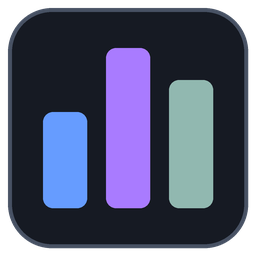
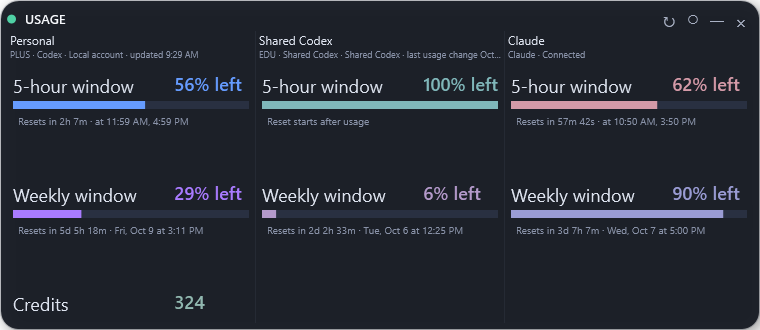
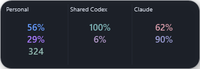
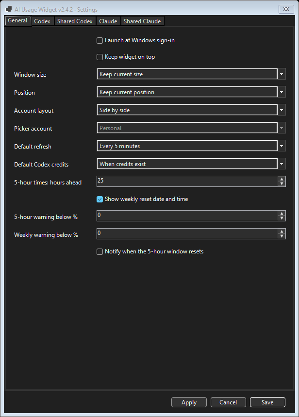
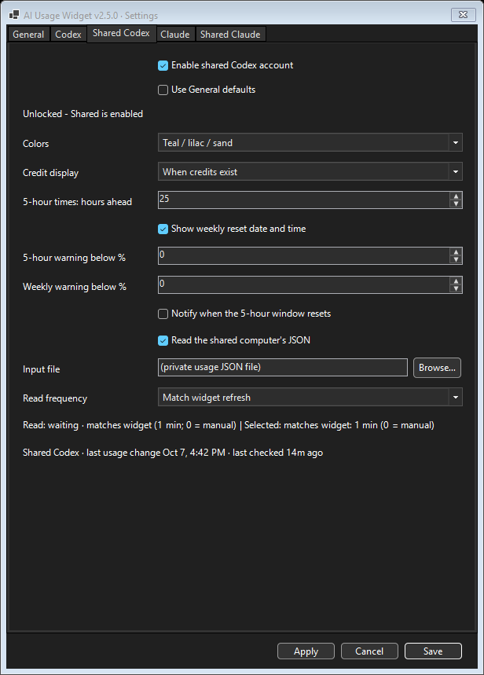
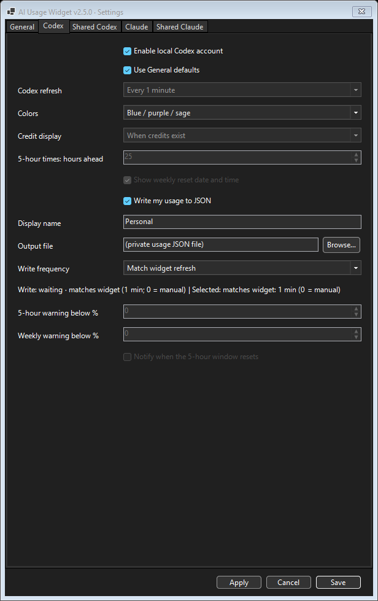
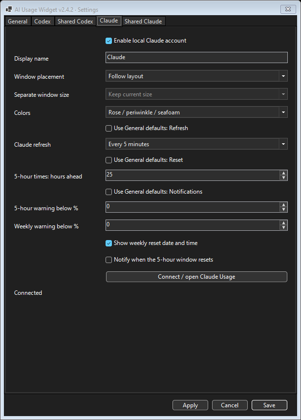
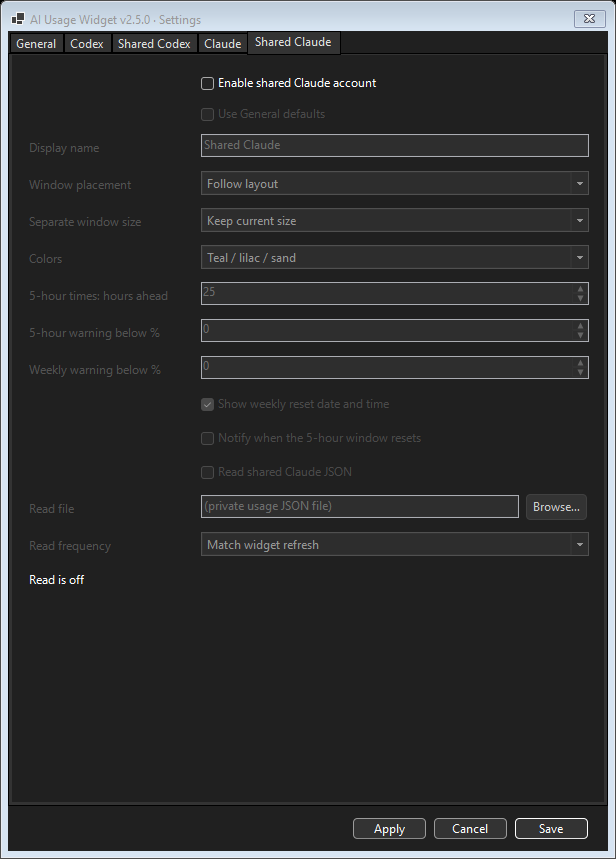

# AI Usage Widget

A small Windows desktop and tray widget for **Codex and Claude subscription usage left**, reset times, credits where available, and notifications. Show local accounts and accounts from another computer through private shared JSON files.

**Version 2.5.1** · [Changelog](changelog.md) · [Detailed guide and troubleshooting](extradetails.md)

## Quick start

1. Install **PowerShell 7**. Install and sign in to **Codex** if you want local Codex readings. Claude connects separately in Settings.
2. Download the repository and extract it. Keep all files together.
3. Double-click **Start-AIUsageWidget.cmd**.

Optional: run **Create-DesktopShortcut.cmd** for a desktop shortcut. OneDrive destinations include the computer name to avoid shortcut conflicts between machines. Enable **Launch at Windows sign-in** from the tray menu for automatic startup.

## Widget sizes

Percentages show **quota remaining**: 100% is full and 0% is exhausted. Credits appear when available.

| Mini | Small | Medium | Large / Default |
| --- | --- | --- | --- |
|  |  |  |  |

Resize wide and short for horizontal metrics, or shrink to menu-bar height for one stationary line: account name, 5-hour percentage/countdown, weekly percentage/countdown, and available credits. Narrowing hides countdowns first, then metric labels; making it taller restores the usual rows. Connected side-by-side and stacked panels share spacing and display transitions.

Drag to move; hover to resize from either bottom corner. Use **↻** to refresh, **◉ / ○** for always on top, **—** to minimize to the tray, and **×** to exit (hide just that account in Separate windows). Hidden buttons appear on hover. Double-click the tray icon to restore the window; hover for local quota and available credits.

## Settings

Right-click the tray icon → **Settings...**. **General** holds window/startup controls and default refresh, reset-display, notification and Codex credit settings. **Codex**, **Shared Codex**, **Claude**, and **Shared Claude** each have one “Use General defaults” switch at the top for all supported account settings; unchecking restores the account’s manual values. Colors stay independent. Turn off any source you do not use; its panel, refreshes and alerts stop. You can use the widget while Settings is open. **Apply** updates the widget without closing Settings; **Save** applies and closes. Shared settings lock when **Enable shared Codex account** is off. Hover over settings or their labels for help. **0 disables a warning threshold.** Reset alerts require weekly quota above 0%.

| General defaults | Shared Codex |
| --- | --- |
|  |  |

Codex and Claude account settings

| Codex | Claude | Shared Claude |
| --- | --- | --- |
|  |  |  |

For two accounts, choose a private synced folder outside this project. Each computer writes its own file from its **Codex** or **Claude** source tab and reads the other’s from **Shared Codex** or **Shared Claude**. Exporting works with the shared account disabled; enable shared accounts only to import readings. Choose **Side by side**, **Stacked**, **Account picker**, or **Separate windows**; Side by side keeps two numeric columns at Mini size. Separate windows remember independent sizes and positions; use the tray menu to reopen either account. File checks can match the widget or use separate timers. Exports change only when usage or account details change, with an automatic check-in at least every 30 minutes. While five-hour usage remaining is 100%, both reset-time changes are ignored in exports until usage begins. [Setup instructions](extradetails.md#two-computers-and-file-sharing).

For Claude, enable it in **Settings → Claude**, click **Apply**, then **Connect / open Claude Usage** and sign in on Claude’s website. An optional Microsoft WebView2 browser profile stays private on this computer. Developer API token usage and spending are not included. [Claude setup and limitations](extradetails.md#claude-subscriptions).

Widget screenshots show captured real usage readings; settings screenshots show the current release. Account names are neutral and private file paths are replaced with placeholders. Settings stay local to each computer.

## Disclaimer

Review and understand the scripts before running them. This is an unofficial community project and is not affiliated with, endorsed by, or supported by OpenAI, the Codex team, or Anthropic. Use at your own discretion.
