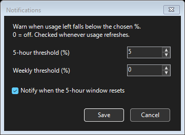

# Codex Usage Widget

A small Windows desktop and tray widget for Codex **5-hour and weekly usage left**, reset countdowns, credits, and notifications.

**Version 1.7.2** · [Changelog](changelog.md) · [Detailed guide and troubleshooting](extradetails.md)

## Quick start

1. Install **PowerShell 7** and **Codex**, and sign in to Codex on this computer.
2. Download the repository and extract it. Keep the files together.
3. Double-click **Start-CodexUsageWidget.cmd**.

Optional: run **Create-DesktopShortcut.cmd** to add a desktop shortcut. Enable **Launch at Windows sign-in** from the tray menu for automatic startup.

## Widget sizes

Percentages show **quota remaining**: 100% is full and 0% is exhausted. Credits appear when available.

| Mini | Small | Medium | Large / Default |
| --- | --- | --- | --- |
|  |  |  |  |

Drag to move or resize. Use **↻** to refresh, **◉ / ○** for always on top, **—** to minimize to the tray, and **×** to exit. Hidden buttons appear on hover. Double-click the tray icon to restore the window.

## Settings

Right-click the tray icon to open the settings menu. Choose **Notifications...** for low-quota warnings and the 5-hour reset alert. **0 disables a threshold.** Reset alerts require weekly quota above 0%.

| Settings menu | Notification settings |
| --- | --- |
|  |  |

Screenshots show captured usage and settings, not live values. Settings are saved locally on each computer.

## Disclaimer

Review and understand the scripts before running them. This is an unofficial community project and is not affiliated with, endorsed by, or supported by OpenAI or the Codex team. Use at your own discretion.
