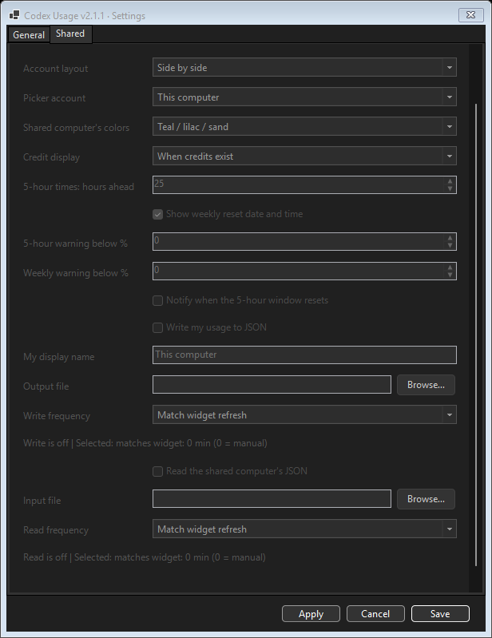
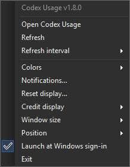

# Extra details

[Quick start and screenshots](README.md) · [Changelog](changelog.md)

This guide covers AI Usage Widget 2.3.0.

For development checks, see [tests/README.md](tests/README.md). The regression runner uses temporary state and example readings without accessing a live account.

## Requirements

- **Windows with PowerShell 7 installed on each computer.** Built-in Windows PowerShell 5.1 alone is not sufficient; this version does not provide a 5.1 fallback.
- **Codex installed and signed in locally** only if local Codex is enabled, with its native `codex.exe` available to the usage reader. Shared accounts and Claude do not require a local Codex sign-in.
- Keep all widget files together, including all `Widget*.ps1` helpers and `Setup-ClaudeWebView.ps1`, and let OneDrive finish syncing before launching on another computer. Syncing the widget folder does not install PowerShell 7 or Codex.

## Run it

Double-click `Start-AIUsageWidget.cmd`.

If this folder's widget is already running in your Windows session, a manual launch offers **Restart widget** or **Cancel**. Restart closes the old instance normally so settings are saved before loading the current version. If it cannot close within 10 seconds, the launcher asks you to close it yourself; it never force-kills the widget. Simultaneous shortcut clicks are coordinated to avoid competing launches. Launch through the CMD file or desktop shortcut; directly running the main script bypasses this check.

Enable **Launch at Windows sign-in** in the tray menu to start the desktop widget when you sign in. The setting uses a per-user Startup shortcut and is independent on each computer. Turn it off in the same menu to remove that shortcut. Automatic startup quietly leaves an existing instance running. Manual shortcut restart requests a full application exit, saves both account windows, and closes Settings before launching the replacement. When updating from 2.1.1 or earlier, choose **Exit** from the existing tray menu once before launching the updated version. Keep the widget folder in place and available locally at sign-in. Closing the Codex desktop app does not stop the widget: the widget uses its own short-lived usage-reader process and the locally installed Codex executable and saved sign-in.

For a shortcut with the three-color icon, double-click **Create-DesktopShortcut.cmd** after placing the widget folder in its permanent location. It creates a local desktop shortcut using that computer's paths. Include both `Create-DesktopShortcut.cmd` and `Create-DesktopShortcut.ps1` when sharing the widget files. Each recipient runs the helper once; the generated `.lnk` contains local paths. If its destination is inside a registered OneDrive folder, the helper names it **AI Usage Widget - HOSTNAME** using the full local hostname (falling back to the Windows computer name if unavailable) so synced desktops do not overwrite each other's shortcuts. Elsewhere it remains **AI Usage Widget**. Detection uses OneDrive account registrations and environment variables, including custom sync locations. The helper removes an old generic or shortened-name shortcut only if it points to this exact widget folder; shared computers' shortcuts are preserved. Each named shortcut works on its intended computer. Alternatively, `Start-AIUsageWidget.cmd` already launches portably from the folder beside it. Creating a shortcut does not install PowerShell 7 or Codex, enable Windows startup, or launch the widget.

The main files are `AIUsageWidget.ps1`, `Start-AIUsageWidget.ps1`, `Start-AIUsageWidget.cmd`, and `AIUsage-Tricolor.ico`. The old `Start-CodexUsageWidget.ps1` and `Start-CodexUsageWidget.cmd` are forwarding launchers for existing shortcuts. Run **Create-DesktopShortcut.cmd** again to create the newly named shortcut and retire an owned old shortcut. The repository URL remains unchanged.

Saved settings and the Claude browser profile remain under the legacy `%LOCALAPPDATA%\CodexUsageWidget` folder so the rename does not discard preferences or sign-in. The sign-in shortcut retains its legacy filename and is updated to the new launcher and icon automatically.

Keep `Start-AIUsageWidget.ps1` beside the CMD launcher. The launcher uses built-in Windows PowerShell to find PowerShell 7 through PATH, common installation folders, or its Microsoft Store registration, then starts the widget hidden.

The usage reader finds `codex.exe` through PATH or the local `%LOCALAPPDATA%\OpenAI\Codex\bin` installation, including versioned subfolders. You do not need to launch the widget from inside Codex.

If startup reports a missing dependency, install and open Codex and install PowerShell 7 on that computer. For custom installation locations, add the directory containing the missing executable to PATH. A successful launch from inside Codex does not guarantee that Explorer has the same PATH. Wait for all widget files to finish syncing before launching on another computer.

The widget uses the local Codex installation and your existing Codex sign-in. It does not store or display credentials. Usage refreshes every five minutes by default, while reset countdowns update every second when the desktop window is visible. Hiding to the tray pauses countdown rendering, but usage refreshes and alerts continue.

## Controls

The widget stays visible on the desktop without an active taskbar button. Its system-tray icon near the clock provides its menu and restore controls. Windows may place that icon in the tray's overflow area.

- Drag the header or compact background to move the widget. Dragging to a screen edge preserves its size without invoking Windows Snap. Other applications' Snap settings are unchanged.
- Choose **Position → Top left / Top right / Bottom left / Bottom right** in the tray menu to move to a corner of the widget's current monitor, slightly inside the usable area and clear of the taskbar. This restores a hidden widget and saves its position immediately without resizing it. Oversized windows keep their top-left reachable.
- Drag any edge or corner to resize it. The compact badge shows the blue 5-hour percentage above the purple weekly percentage, with a reset countdown beneath each. Countdown labels are the last details to disappear as you shrink it; at the smallest 72×58 size only the percentages and enabled credit count remain. Hover over a percentage for its full reset information. Double-click that compact view to return to the normal size.
- Click `↻` to refresh immediately.
- Click `◉` / `○` to turn always-on-top on or off.
- Click `—` to minimize it to the notification area next to the clock. The tray icon has local 5-hour and weekly bars; its credit stripe appears only for enabled positive/unlimited credits. Hover for exact local percentages and available credits, and double-click to restore the widget.
- Click `×` to close it.
- If the normal controls are hidden, hover over the widget to reveal **Refresh**, **Always on top**, **Minimize to tray**, and **×** at the top right. The smallest sizes use two rows so all four buttons fit; they temporarily overlay the readouts. An already-visible compact refresh button moves into this group instead of creating a duplicate. Moving the pointer away restores the normal display. Closing this way saves settings just like the normal close button.
- Right-click the tray icon and choose **Settings... → Codex → Codex refresh** to select 1, 5, 15, or 30 minutes, or manual-only refresh. Five minutes is the default.
- Choose **Settings... → Codex** for the local palette and **Shared Codex** for the second account, each with six coordinated choices. Individual color pickers have been replaced by presets; older custom colors migrate to blue/purple/sage. White labels stay white. The Fuchsia palette is labeled **Fuchsia / mauve / mist**; saved selections of its old name migrate automatically. Quota bars and the live app/tray icon follow the local palette; the desktop shortcut retains its identity colors.

Its last screen position, size, and always-on-top choice are stored per computer in `%LOCALAPPDATA%\CodexUsageWidget\widget-state.json`.

## Credits and notifications

Reset countdowns sit directly beneath their usage bars. Percentages and credit totals share a value column and align by their first digit. The header title, status dot, and window buttons share one aligned row.

**Settings... → Codex** independently controls the 5-hour clock/schedule and weekly date. The 5-hour setting accepts 0–168 hours ahead, defaults to 25, and uses **0 to turn that display off**. The weekly checkbox defaults to on. Turning either display off keeps its countdown and does not change notification settings. Save applies these preferences immediately and stores them on this computer.

The next reset uses the actual timestamp returned by Codex. Subsequent times assume immediate reuse after each window ends; they are not guaranteed appointments. The visible line is simply **at 1:22 PM, 6:22 PM...**, with estimation context in hover text and settings. A new five-hour window starts with your first request after the previous window ends, so a pause in use can shift later reset times. Every successful usage refresh rebuilds the schedule from the latest server timestamp, and an expired timestamp stops producing estimates until a fresh reset is reported. The selected refresh interval and manual Refresh remain unchanged. See [OpenAI's usage guide](https://help.openai.com/en/articles/20001516-managing-usage-with-gpt-6-astra-in-work-and-codex).

Hours ahead are counted from the current time. The actual next reset remains visible even if it falls beyond a short look-ahead; later estimates must fall within the selected range. Times use this computer's local time zone. Projections advance by the reported window duration, using five hours when it is unavailable, and account for daylight-saving changes. The weekly line uses the actual reset day, date, and time without projecting future weeks or repeating “Resets on.”

Time/date details sit beside their countdown when the complete line fits, then move underneath and wrap as the window narrows. As height decreases, bars and header/footer details yield space to the reset information. If the full schedule no longer fits, only the actual next reset remains, then only the countdown. Hover over a reset label or compact percentage to see the full enabled schedule. At the smallest sizes, numbers remain the priority.

- **Settings... → Codex → Credit display → When credits exist** is the default: positive or unlimited credits appear even when subscription quota remains. Choose **Always show** to keep the readout visible for zero or unavailable balances, or **Off** to hide it. Balances are rounded to whole credits for display; the account balance itself is unchanged. The Credits row uses the same white-label/colored-value alignment as the quota rows. The default credit color is muted blue-green. Unknown balances use a dash and unlimited balances use ∞ in the smallest view. These are usage credits, not free quota-reset grants.
- Resizing measures the readouts and available space. It removes header/footer details first, then bars, while retaining labeled values and reset countdowns. Only when labeled rows no longer fit does it switch to the numeric badge. With credits visible, that badge keeps three numeric readouts and removes captions and countdowns as necessary to fit. Numeric font sizes also adapt to the minimum window size. Drag the background to move the intermediate layout.
- **Settings... → Codex** provides separate 5-hour and weekly percentage thresholds. Both default to **0 (off)**. A threshold of 20 warns when the remaining percentage is below 20, including zero. Checks run after successful usage refreshes, so the refresh interval controls warning latency. An already-low quota warns on the first successful check unless its saved notification state says that warning was already sent; relaunching does not repeat it.
- Enable **Notify when the 5-hour window resets** for a one-time notification after a successful refresh confirms quota has recovered following the observed reset time. This defaults to off and works even when low-usage thresholds are 0. The first observation establishes a baseline without notifying. Reset state is saved to avoid repeats after restarting; enabling the option starts fresh. Notifications follow your refresh interval (manual-only requires Refresh), continue while minimized to the tray, and may be suppressed by Windows notification settings. The notification includes the remaining percentage and only appears when the same refresh confirms weekly quota above 0%. Exhausted or unavailable weekly quota suppresses that reset notice.
- A warning is not repeated while quota stays below its threshold, even if the server changes its reset timestamp or the widget restarts. It rearms after quota recovers to the threshold or above. Disabling a threshold clears its warning state. Sent warnings are saved locally in `warning-state.json`. Windows notification settings and Do Not Disturb can suppress the popup. The widget must remain running to check usage.
- Account, sharing, and notification preferences save immediately with Apply or Save. Manual window resizing still saves on normal exit.

## Window sizes and manual refresh

The tray/settings controls follow Windows' app light/dark preference using native Windows Forms theming when supported by the installed PowerShell runtime. Restart the widget after changing the Windows theme. Older runtimes retain their standard Windows control styling. The widget itself retains its dark background and custom readout colors.

Choose **Window size** in the tray menu for four distinct display sizes:

| Preset | Size | Display |
| --- | --- | --- |
| Mini | 72 × 72 | Numeric badge |
| Small | 140 × 155 | Labeled values and reset countdowns |
| Medium | 190 × 210 | Labeled values and reset details; bars/header appear as space permits |
| Large / Default | 280 × 290 | Full reset details, bars, plan line, and footer |

Dimensions are Windows logical pixels. Large and Default are now one preset. Presets save immediately and restore when reopening; manually resized dimensions still save on normal exit. Existing saved sizes remain unchanged until you choose a preset. Double-clicking the compact badge returns to the new Large / Default size. Width transitions measure the text and controls, using the center gap before shortening labels or hiding details.

When the full header no longer fits, a small refresh button remains at the top right only while the numbers, credits, and both reset countdowns also fit. The compact button yields space before either countdown disappears; refresh is still available on hover. Tray-menu **Refresh** remains available at every size. Refresh interval changes save immediately; choosing one minute sets a 60-second usage timer.

## Settings panels

Open **Settings...** from the tray menu. **General** holds window size, position, startup, always-on-top, account layout and default account preferences. **Codex** configures this computer's Codex account. **Shared Codex** mirrors its color, credits, reset-display and notification controls for the imported account, and adds layouts and file connections. Shared controls are scrollable to reach connections below the account preferences.

Dropdowns use consistent colors matching the panel's dark or light theme. Resize handles appear at both bottom corners on hover, including each separate account window.

Explanations appear as hover tooltips on the related controls and labels; live lock state, file-operation status and source age remain visible.

Settings remains open without blocking either desktop window. Account picker labels follow this computer's saved display name and the imported JSON nickname. The inline selector uses the widget's dark theme. Account headings shrink and shorten before disappearing; full names remain on hover.

**Apply** validates, saves, and displays changes without closing Settings. **Save** does the same and closes. **Cancel** discards unapplied edits; it does not undo changes already applied.

Each account has separate **Use General defaults** switches for refresh, reset display and notifications. Codex accounts can also inherit credit display. Checked groups preview General's values and lock the account controls; unchecking restores custom values. **Apply** saves defaults and overrides without closing the dialog; **Cancel** discards changes made since the last Apply. Existing installations retain their account choices with inheritance off. Colors, names, account enable switches, connection files and publishing cadence remain independent. For shared sources, inherited refresh controls the input file-reading cadence.

Wide, short windows automatically show static metric columns: 5-hour, weekly and credits when enabled. Account names remain above each group; unavailable/disabled Claude credits stay blank. There is no animation or scrolling. Narrowing or increasing height restores the vertical format.

**Enable shared Codex account** unlocks its controls. Turning it off and applying stops file writing/reading, hides the second account, stops its alerts and file timers, and preserves all connection and account choices. The switch remains available while the rest of Shared is locked. Writing and reading have independent switches within the enabled tab.

Codex and Shared screenshots are in the [README](README.md). File connections appear farther down Shared:

## Two computers and file sharing

The same OneDrive folder can be used from multiple Windows computers at the same time. Each computer needs Codex and PowerShell 7 installed and must be signed in to Codex locally. Credentials and Codex caches remain local to each computer; the widget scripts sync through OneDrive. Optional usage JSON files contain quota information, not credentials.

Sharing is opt-in and configured separately on each computer under **Settings... → Shared Codex**. Both machines need access to a private synced folder, such as OneDrive. They may use different Codex accounts. Keep the JSON files outside the public widget project and do not commit them to Git.

1. Create a private shared folder, for example `WidgetUsage`, separate from this project.
2. On Computer A, turn on **Enable shared Codex account**, enable **Write my usage to JSON**, give it a nickname, and choose a new `account-a.json` output file. Save to create its first file after a successful local reading.
3. On Computer B, enable Shared and do the same with a different nickname and `account-b.json`.
4. After the files sync, enable **Read the shared computer's JSON** on A and select B's file; on B select A's file. Paths may differ between computers. Never select the same file as input and output.
5. On **Shared Codex**, select Side by side, Stacked, Account picker, or Separate windows and a palette for the second account. Use **Codex** for the local palette. Then choose a window preset if needed.

| Connection | Computer A | Computer B |
| --- | --- | --- |
| Output | `account-a.json` | `account-b.json` |
| Input | `account-b.json` | `account-a.json` |

Writing uses an atomic file replacement. Unchanged readings do not rewrite the export, even after a fresh usage check or manual refresh. Usage values, credits, resets, and account metadata changes are published at the selected write cadence. Automatic sharing checks in after 30 minutes without changes; explicit Manual only remains manual. The JSON records last usage change separately from the reading's actual check time. Unchanged shared files are checked by file metadata without reparsing. Existing output files must belong to this widget's saved random source identifier; unrelated files and another computer's exports are not overwritten. Keep the local preferences file when updating the widget so its identifier and connections remain intact. After deleting local preferences, choose a new output filename rather than trying to claim an old export.

**Write frequency** and **Read frequency** each offer Match widget refresh, 1/5/15/30 minutes, or Manual only. Matched reads run when a local refresh starts; matched writes follow a successful local refresh. Separate write timers publish the latest existing reading, without making extra Codex requests or changing its original update time. Manual Refresh reads immediately and publishes when the local request succeeds. Saving an enabled connection performs an initial read/write if data is available. Independent file timers continue while minimized to the tray; disabled and manual connections add no idle file polling. Automatic matched writers keep a lightweight timer for the 30-minute check-in.

Sharing shows separate last-write/read statuses and the imported usage's age. A recent file read does not imply recent usage: if the shared computer/widget stops, its numbers remain visible and become **stale** after the 30-minute check-in interval plus twice its reported refresh interval, with a two-minute minimum. Older exports without check-in metadata retain the previous twice-refresh-interval rule. Manual sources do not acquire fresh timestamps merely by rewriting an old reading. Shared alerts still require a reading within twice the source refresh interval, with a two-minute minimum. OneDrive delivery adds its own delay. Missing, malformed, or older files retain the last valid reading with an error indicator. An input path change clears the previous source. Imported readings are not cached across widget restarts; they reload from the selected file.

The two sources are displayed independently, never summed. Tray bars and hover text follow the selected enabled account. Opening Codex or Claude from the tray selects that provider’s account. Codex notification preferences apply locally; Shared notification preferences apply to imported readings and label their popups with the other account name. Shared thresholds default to 0 and its reset alert defaults to off. Warnings are sent once per crossing, with separate persisted history for each account. Shared reset alerts require weekly quota above 0%, just like local resets. Stale or failed file reads never trigger shared alerts. Independent credit and reset-display settings affect only their respective account cards. Side by side and Stacked use shared fit decisions across connected accounts, align value/bar rows, and reserve invisible credit space for providers without credits. It retains numeric columns and dividers at Mini size; headings and update status stay available on hover when they no longer fit. The shared computer defaults to teal/lilac/sand so the two accounts are easy to distinguish.

**Separate windows** uses one independently movable and resizable window per account, with one shared tray icon and refresh process. Sizes, positions, and always-on-top choices are saved for each window. Closing or minimizing either window hides only that account; reopen it from the tray menu. Double-clicking the tray icon opens the local window. General size/position controls target the local window; the tray also offers Shared window size presets. Use **Exit** in the tray menu to stop both windows. Returning to a combined layout restores its previous bounds.

Each Separate window uses the Single account preset dimensions below.

| Preset | Single account | Side by side | Stacked | Account picker |
| --- | --- | --- | --- | --- |
| Mini | 72 × 72 | 150 × 72 | 72 × 144 | 72 × 72 |
| Small | 140 × 155 | 300 × 180 | 180 × 320 | 160 × 180 |
| Medium | 190 × 210 | 400 × 250 | 240 × 470 | 220 × 260 |
| Large / Default | 280 × 290 | 560 × 330 | 300 × 600 | 300 × 330 |

## Refresh and startup errors

A failed refresh retains the last known numbers and adds an amber border. Hover over the widget or its readouts for the error; the tray tooltip also marks readings as potentially stale. A request times out after 45 seconds. Retry with Refresh or wait for the selected interval. A successful response restores normal styling. Missing percentages display as unavailable, never as 100% remaining.

Hidden startup failures show a popup and, when writable, save diagnostic details to `%LOCALAPPDATA%\CodexUsageWidget\startup-error.log`. This log contains the most recent unhandled error rather than an ongoing usage history.

## Sharing and privacy

Publish only the widget project folder. The supplied scripts and icon contain no hardcoded personal names, computer paths, account identifiers, or credentials. Optional exports whitelist quota windows, reset timestamps, plan type, credit balance, freshness metadata, your chosen nickname, and a generated random source identifier. Anyone with access to those files can read that usage information; keep them private. Executable locations, Windows user identity, and local folders are resolved on the computer running the widget. The reader requests quota data through the local Codex installation and returns usage windows, plan information, and credits; it does not export sign-in credentials.

Settings, notification state, and startup-error diagnostics are stored in `%LOCALAPPDATA%\CodexUsageWidget`, outside this project. Shared notification history uses `shared-warning-state.json`; it is separate from local warnings. Generated desktop and Startup shortcuts contain local paths. The included `.gitignore` excludes shortcuts, logs, local state, credential files, and common scratch folders. Do not copy Codex authentication files, caches, raw usage responses, or diagnostics into a public repository. Review any additional files before sharing them; error logs can include local paths.

## Claude subscriptions

Enable **Claude** in its Settings tab, click **Apply**, then **Connect / open Claude Usage**. Sign in manually on Claude’s own website. This is a separate browser session; an existing desktop-app sign-in is not copied. Closing the connection window hides it while subscription refreshes continue. You can reopen it to change the active subscription or sign in again.

The optional connection requires the [Microsoft Edge WebView2 Runtime](https://developer.microsoft.com/en-us/microsoft-edge/webview2/). First use downloads a pinned Microsoft WebView2 SDK from NuGet and verifies Microsoft’s assembly signatures. SDK files, Microsoft’s license, and the private browser profile are stored under the widget’s LocalAppData directory, outside this repository and synced folders. Do not share that browser profile.

The connector reads Claude.ai’s undocumented subscription usage endpoint inside the authenticated browser. It does not copy session cookies, reuse Claude Code credentials, or require a developer API key. The endpoint may change. Authentication failures, network errors and rate limits retain the last reading with an explicit status. Rate limits pause requests for at least 15 minutes. Missing limits appear as **—**, including plans that do not expose a meter. Claude extra-usage spending is not displayed as Codex credits. Model-specific limits and developer API billing are not included in this release.

Choose an independent refresh interval and palette, reset details, warning thresholds and reset notifications. Claude can follow the General account layout, remain attached, or use a separate window with remembered size and position. General’s layout supports all enabled accounts, including four columns or four stacked cards. Tray entries reopen detached Claude windows individually. Exit and shortcut restart close the browser and all account windows together.

## Sharing Claude between computers

In **Shared Claude**, enable the master switch and choose separate Claude output and input JSON files outside the public project. Each computer writes its own local Claude reading and reads the other computer’s file. Do not reuse Codex JSON files: snapshots carry a provider label and incorrect provider files are rejected. Both computers should use version 2.2.0 or later.

Write and read switches and intervals are independent. Matching reads follow the local Claude refresh interval even if local Claude is disabled; manual-only stays manual. Local Claude must be enabled and freshly connected to publish new readings. Exports change only when usage or account metadata changes, with automatic 30-minute check-ins. Shared Claude has its own colors, reset display, notifications, placement, window size and position. Its name comes from the imported file. Failed or stale imports keep the last known reading and cannot trigger fresh-usage alerts.

To show only **shared Codex and local Claude**, turn off **Enable local Codex account** in Codex, enable Shared Codex’s reader, and enable Claude. Disabled sources stop their panels, service polling and alerts while preserving their saved settings. Disabling local Codex also stops its JSON publisher. All sources can be disabled while Settings remains accessible through the tray.
