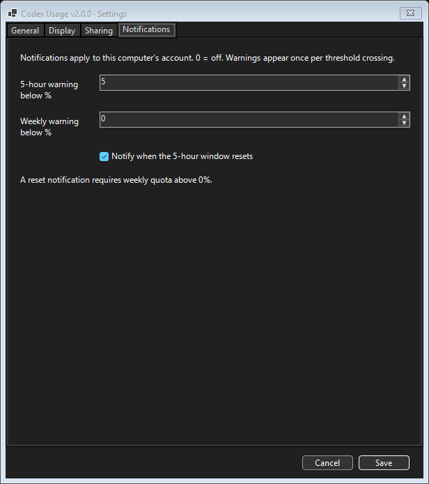

# Extra details

[Quick start and screenshots](README.md) · [Changelog](changelog.md)

This guide covers Codex Usage Widget 2.0.1.

## Requirements

- **Windows with PowerShell 7 installed on each computer.** Built-in Windows PowerShell 5.1 alone is not sufficient; this version does not provide a 5.1 fallback.
- **Codex installed and signed in locally**, with its native `codex.exe` available to the usage reader.
- Keep all widget files together, including `WidgetSharing.ps1`, `WidgetAccounts.ps1`, and `WidgetSettings.ps1`, and let OneDrive finish syncing before launching on another computer. Syncing the widget folder does not install PowerShell 7 or Codex.

## Run it

Double-click `Start-CodexUsageWidget.cmd`.

If this folder's widget is already running in your Windows session, a manual launch offers **Restart widget** or **Cancel**. Restart closes the old instance normally so settings are saved before loading the current version. If it cannot close within 10 seconds, the launcher asks you to close it yourself; it never force-kills the widget. Simultaneous shortcut clicks are coordinated to avoid competing launches. Launch through the CMD file or desktop shortcut; directly running the main script bypasses this check.

Enable **Launch at Windows sign-in** in the tray menu to start the desktop widget when you sign in. The setting uses a per-user Startup shortcut and is independent on each computer. Turn it off in the same menu to remove that shortcut. Automatic startup quietly leaves an existing instance running. Keep the widget folder in place and available locally at sign-in. Closing the Codex desktop app does not stop the widget: the widget uses its own short-lived usage-reader process and the locally installed Codex executable and saved sign-in.

For a shortcut with the three-color icon, double-click **Create-DesktopShortcut.cmd** after placing the widget folder in its permanent location. It creates a local desktop shortcut using that computer's paths. Include both `Create-DesktopShortcut.cmd` and `Create-DesktopShortcut.ps1` when sharing the widget files. Each recipient runs the helper once; the generated `.lnk` contains local paths. If its destination is inside a registered OneDrive folder, the helper names it **Codex Usage - COMPUTERNAME** so synced desktops do not overwrite each other's shortcuts. Elsewhere it remains **Codex Usage**. Detection uses OneDrive account registrations and environment variables, including custom sync locations. The helper removes an old generic shortcut only if it points to this exact widget folder; other computers' shortcuts are preserved. Each named shortcut works on its intended computer. Alternatively, `Start-CodexUsageWidget.cmd` already launches portably from the folder beside it. Creating a shortcut does not install PowerShell 7 or Codex, enable Windows startup, or launch the widget.

Keep `Start-CodexUsageWidget.ps1` beside the CMD launcher. The launcher uses built-in Windows PowerShell to find PowerShell 7 through PATH, common installation folders, or its Microsoft Store registration, then starts the widget hidden.

The usage reader finds `codex.exe` through PATH or the local `%LOCALAPPDATA%\OpenAI\Codex\bin` installation, including versioned subfolders. You do not need to launch the widget from inside Codex.

If startup reports a missing dependency, install and open Codex and install PowerShell 7 on that computer. For custom installation locations, add the directory containing the missing executable to PATH. A successful launch from inside Codex does not guarantee that Explorer has the same PATH. Wait for all widget files to finish syncing before launching on another computer.

The widget uses the local Codex installation and your existing Codex sign-in. It does not store or display credentials. Usage refreshes every five minutes by default, while reset countdowns update every second when the desktop window is visible. Hiding to the tray pauses countdown rendering, but usage refreshes and alerts continue.

## Controls

The widget stays visible on the desktop without an active taskbar button. Its system-tray icon near the clock provides its menu and restore controls. Windows may place that icon in the tray's overflow area.

- Drag the header or compact background to move the widget. Dragging to a screen edge preserves its size without invoking Windows Snap. Other applications' Snap settings are unchanged.
- Choose **Position → Top left / Top right / Bottom left / Bottom right** in the tray menu to move to a corner of the widget's current monitor, slightly inside the usable area and clear of the taskbar. This restores a hidden widget and saves its position immediately without resizing it. Oversized windows keep their top-left reachable.
- Drag any edge or corner to resize it. The compact badge shows the blue 5-hour percentage above the purple weekly percentage, with a reset countdown beneath each. Countdown labels are the last details to disappear as you shrink it; at the smallest 72×58 size only the percentages and enabled credit count remain. Hover over a percentage for its full reset information. Double-click that compact view to return to the normal size.
- Click `↻` to refresh immediately.
- Click `◉` / `○` to turn always-on-top on or off.
- Click `—` to minimize it to the notification area next to the clock. The tray icon has local 5-hour and weekly bars; its credit stripe appears only for enabled positive/unlimited credits. Hover for exact local percentages and available credits, and double-click to restore the widget.
- Click `×` to close it.
- If the normal controls are hidden, hover over the widget to reveal **Refresh**, **Always on top**, **Minimize to tray**, and **×** at the top right. The smallest sizes use two rows so all four buttons fit; they temporarily overlay the readouts. An already-visible compact refresh button moves into this group instead of creating a duplicate. Moving the pointer away restores the normal display. Closing this way saves settings just like the normal close button.
- Right-click the tray icon and choose **Settings... → General → Widget refresh** to select 1, 5, 15, or 30 minutes, or manual-only refresh. Five minutes is the default.
- Choose **Settings... → Display** for six coordinated palettes with separate choices for each account. Individual color pickers have been replaced by presets; older custom colors migrate to blue/purple/sage. White labels stay white. Quota bars and the live app/tray icon follow the local palette; the desktop shortcut retains its identity colors.

Its last screen position, size, and always-on-top choice are stored per computer in `%LOCALAPPDATA%\CodexUsageWidget\widget-state.json`.

## Credits and notifications

Reset countdowns sit directly beneath their usage bars. Percentages and credit totals share a value column and align by their first digit. The header title, status dot, and window buttons share one aligned row.

**Settings... → Display** independently controls the 5-hour clock/schedule and weekly date. The 5-hour setting accepts 0–168 hours ahead, defaults to 25, and uses **0 to turn that display off**. The weekly checkbox defaults to on. Turning either display off keeps its countdown and does not change notification settings. Save applies these preferences immediately and stores them on this computer.

The next reset uses the actual timestamp returned by Codex. Subsequent times assume immediate reuse after each window ends; they are not guaranteed appointments. The visible line is simply **at 1:22 PM, 6:22 PM...**, with estimation context in hover text and settings. A new five-hour window starts with your first request after the previous window ends, so a pause in use can shift later reset times. Every successful usage refresh rebuilds the schedule from the latest server timestamp, and an expired timestamp stops producing estimates until a fresh reset is reported. The selected refresh interval and manual Refresh remain unchanged. See [OpenAI's usage guide](https://help.openai.com/en/articles/20001516-managing-usage-with-gpt-6-astra-in-work-and-codex).

Hours ahead are counted from the current time. The actual next reset remains visible even if it falls beyond a short look-ahead; later estimates must fall within the selected range. Times use this computer's local time zone. Projections advance by the reported window duration, using five hours when it is unavailable, and account for daylight-saving changes. The weekly line uses the actual reset day, date, and time without projecting future weeks or repeating “Resets on.”

Time/date details sit beside their countdown when the complete line fits, then move underneath and wrap as the window narrows. As height decreases, bars and header/footer details yield space to the reset information. If the full schedule no longer fits, only the actual next reset remains, then only the countdown. Hover over a reset label or compact percentage to see the full enabled schedule. At the smallest sizes, numbers remain the priority.

- **Settings... → Display → Credit display → When credits exist** is the default: positive or unlimited credits appear even when subscription quota remains. Choose **Always show** to keep the readout visible for zero or unavailable balances, or **Off** to hide it. Balances are rounded to whole credits for display; the account balance itself is unchanged. The Credits row uses the same white-label/colored-value alignment as the quota rows. The default credit color is muted blue-green. Unknown balances use a dash and unlimited balances use ∞ in the smallest view. These are usage credits, not free quota-reset grants.
- Resizing measures the readouts and available space. It removes header/footer details first, then bars, while retaining labeled values and reset countdowns. Only when labeled rows no longer fit does it switch to the numeric badge. With credits visible, that badge keeps three numeric readouts and removes captions and countdowns as necessary to fit. Numeric font sizes also adapt to the minimum window size. Drag the background to move the intermediate layout.
- **Settings... → Notifications** provides separate 5-hour and weekly percentage thresholds. Both default to **0 (off)**. A threshold of 20 warns when the remaining percentage is below 20, including zero. Checks run after successful usage refreshes, so the refresh interval controls warning latency. An already-low quota warns on the first successful check unless its saved notification state says that warning was already sent; relaunching does not repeat it.
- Enable **Notify when the 5-hour window resets** for a one-time notification after a successful refresh confirms quota has recovered following the observed reset time. This defaults to off and works even when low-usage thresholds are 0. The first observation establishes a baseline without notifying. Reset state is saved to avoid repeats after restarting; enabling the option starts fresh. Notifications follow your refresh interval (manual-only requires Refresh), continue while minimized to the tray, and may be suppressed by Windows notification settings. The notification includes the remaining percentage and only appears when the same refresh confirms weekly quota above 0%. Exhausted or unavailable weekly quota suppresses that reset notice.
- A warning is not repeated while quota stays below its threshold, even if the server changes its reset timestamp or the widget restarts. It rearms after quota recovers to the threshold or above. Disabling a threshold clears its warning state. Sent warnings are saved locally in `warning-state.json`. Windows notification settings and Do Not Disturb can suppress the popup. The widget must remain running to check usage.
- Notification preferences are saved immediately when you click Save. Display, sharing, and general preferences save immediately with Save. Manual window resizing still saves on normal exit.

## Window sizes and manual refresh

The tray/settings controls follow Windows' app light/dark preference using native Windows Forms theming when supported by the installed PowerShell runtime. Restart the widget after changing the Windows theme. Older runtimes retain their standard Windows control styling. The widget itself retains its dark background and custom readout colors.

Choose **Window size** in the tray menu for four distinct display sizes:

| Preset | Size | Display |
| --- | --- | --- |
| Mini | 72 × 72 | Numeric badge |
| Small | 140 × 155 | Labeled values and reset countdowns |
| Medium | 190 × 210 | Labeled values and reset details; bars/header appear as space permits |
| Large / Default | 280 × 290 | Full reset details, bars, plan line, and footer |

Dimensions are Windows logical pixels. Large and Default are now one preset. Presets save immediately and restore when reopening; manually resized dimensions still save on normal exit. Existing saved sizes remain unchanged until you choose a preset. Double-clicking the compact badge returns to the new Large / Default size. Width transitions measure the text and controls, using the center gap before shortening labels or hiding details.

When the full header no longer fits, a small refresh button remains at the top right until even the numeric readouts leave insufficient room. Tray-menu **Refresh** remains available at every size. Refresh interval changes save immediately; choosing one minute sets a 60-second usage timer.

## Settings panels

Open **Settings...** from the tray menu. Display and Sharing screenshots are in the [README](README.md); General and Notifications are shown below.

| General | Notifications |
| --- | --- |
|  |  |

## Two computers and file sharing

The same OneDrive folder can be used from multiple Windows computers at the same time. Each computer needs Codex and PowerShell 7 installed and must be signed in to Codex locally. Credentials and Codex caches remain local to each computer; the widget scripts sync through OneDrive. Optional usage JSON files contain quota information, not credentials.

Sharing is opt-in and configured separately on each computer under **Settings... → Sharing**. Both machines need access to a private synced folder, such as OneDrive. They may use different Codex accounts. Keep the JSON files outside the public widget project and do not commit them to Git.

1. Create a private shared folder, for example `WidgetUsage`, separate from this project.
2. On Computer A, enable **Write my usage to JSON**, give it a nickname, and choose a new `account-a.json` output file. Save to create its first file after a successful local reading.
3. On Computer B, do the same with a different nickname and `account-b.json`.
4. After the files sync, enable **Read the other computer's JSON** on A and select B's file; on B select A's file. Paths may differ between computers. Never select the same file as input and output.
5. On **Display**, select Side by side, Stacked, or Account picker, and a palette for each source. Then choose a window preset if needed.

| Connection | Computer A | Computer B |
| --- | --- | --- |
| Output | `account-a.json` | `account-b.json` |
| Input | `account-b.json` | `account-a.json` |

Writing uses an atomic file replacement. Existing output files must belong to this widget's saved random source identifier; unrelated files and another computer's exports are not overwritten. Keep the local preferences file when updating the widget so its identifier and connections remain intact. After deleting local preferences, choose a new output filename rather than trying to claim an old export.

**Write frequency** and **Read frequency** each offer Match widget refresh, 1/5/15/30 minutes, or Manual only. Matched reads run when a local refresh starts; matched writes follow a successful local refresh. Separate write timers publish the latest existing reading, without making extra Codex requests or changing its original update time. Manual Refresh reads immediately and publishes when the local request succeeds. Saving an enabled connection performs an initial read/write if data is available. Independent file timers continue while minimized to the tray; disabled, manual, and matched connections add no idle file polling.

Sharing shows separate last-write/read statuses and the imported usage's age. A recent file read does not imply recent usage: if the other computer/widget stops, its numbers remain visible and become **stale** after twice its reported refresh interval, with a two-minute minimum. Manual sources use that minimum. OneDrive delivery adds its own delay. Missing, malformed, or older files retain the last valid reading with an error indicator. An input path change clears the previous source. Imported readings are not cached across widget restarts; they reload from the selected file.

The two sources are displayed independently, never summed. Tray bars, tray hover text, and notifications always refer to the account signed in on this computer, even when the picker displays the other account. Side by side retains both numeric columns and a divider at Mini size; headings and update status stay available on hover when they no longer fit. The other computer defaults to teal/lilac/sand so the two accounts are easy to distinguish.

| Preset | Single account | Side by side | Stacked | Account picker |
| --- | --- | --- | --- | --- |
| Mini | 72 × 72 | 150 × 72 | 72 × 144 | 72 × 72 |
| Small | 140 × 155 | 300 × 180 | 180 × 320 | 160 × 180 |
| Medium | 190 × 210 | 400 × 250 | 240 × 470 | 220 × 260 |
| Large / Default | 280 × 290 | 560 × 330 | 300 × 600 | 300 × 330 |

## Refresh and startup errors

A failed refresh retains the last known numbers and adds an amber border. Hover over the widget or its readouts for the error; the tray tooltip also marks readings as potentially stale. A request times out after 45 seconds. Retry with Refresh or wait for the selected interval. A successful response restores normal styling. Missing percentages display as unavailable, never as 100% remaining.

Hidden startup failures show a popup and, when writable, save diagnostic details to `%LOCALAPPDATA%\CodexUsageWidget\startup-error.log`. This log contains the most recent unhandled error rather than an ongoing usage history.

## Sharing and privacy

Publish only this `CodexUsageWidget` folder. The supplied scripts and icon contain no hardcoded personal names, computer paths, account identifiers, or credentials. Optional exports whitelist quota windows, reset timestamps, plan type, credit balance, freshness metadata, your chosen nickname, and a generated random source identifier. Anyone with access to those files can read that usage information; keep them private. Executable locations, Windows user identity, and local folders are resolved on the computer running the widget. The reader requests quota data through the local Codex installation and returns usage windows, plan information, and credits; it does not export sign-in credentials.

Settings, notification state, and startup-error diagnostics are stored in `%LOCALAPPDATA%\CodexUsageWidget`, outside this project. Generated desktop and Startup shortcuts contain local paths. The included `.gitignore` excludes shortcuts, logs, local state, credential files, and common scratch folders. Do not copy Codex authentication files, caches, raw usage responses, or diagnostics into a public repository. Review any additional files before sharing them; error logs can include local paths.
